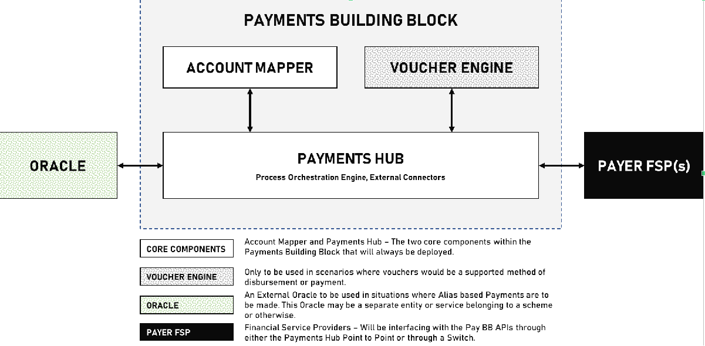

= Bulk Disbursement

The purpose of this document is to provide guidance on all functional and technical aspects of Bulk Disbursement for G2P payments. It aims to cover functionality such as payment to mobile wallets and bank accounts. as well as to outline the steps and requirements necessary to achieve these objectives.
This document is intended for the following audiences so that they may achieve their respective objectives,

* Mifos Development and QA Teams.
** Software developers and engineers at Mifos who will be responsible for implementing the requirements and building the software system will need to understand the detailed functionality and API specifications in order to develop the system as specified.
** The QA teams at Mifos and GovStack will ensure that the software system meets the requirements and functions as defined in this document or in the identified stories from the backlog referenced in this document.

*  Project Management.
** Project managers at Mifos and GovStack will be responsible for overseeing the development process and ensuring that the project is completed on time and within budget. They would need to understand the specifications in order to monitor progress and ensure that the development team is on track.

* Gov-Stack Business Stakeholders.
** Individuals or groups who defined the software system requirements and will use this document to ensure that the system meets their needs and requirements.

To aid these audiences this document aims to provide a clear and concise overview of Bulk Disbursement, ensuring that all relevant parties understand the necessary actions and procedures.

The document also serves as a reference guide, providing a comprehensive overview of Bulk Disbursement and its associated pre-requisites and dependencies. It includes relevant background information, definitions, and key terms, as well as answers to frequently asked questions.

Overall, this document aims to provide a valuable resource for ITU, helping them to successfully navigate the complexities associated with the area of Bulk Disbursement.

== Requirement Compliance

This document is expected to cover the following requirements.

== Background

The Payments Building Block is an ICT Building Block that enables digital financial payments to be tracked, evaluated, initiated, validated, processed, logged, compared, and verified against budget. It also provides interoperability with external applications that require payment services to trigger transitions in their workflow. The Payments Building Block interfaces with regulated financial entities such as banks, credit facilities, and insurance companies through gateways. It converts heterogeneous interface protocols, formats, and user interfaces to a standard set of common interfaces and formats, making it easier for users and government to complete payment transactions and learn if their transaction succeeded or failed.

=== Introduction to the Payments Building Block
The Payment Building Block itself consists of five different modules, two of these are core modules that would be part of every implementation regardless of jurisdiction, these are components that are fundamentally required for processing of G2P Payments. This is the Account Mapper and the Payments Hub. Apart from these there are three supporting components that would be required where needed. The Voucher Engine would be required where the Payments Building Block is expected to support issuance and redemption of vouchers as a mode of payment offline. The Mojaloop Oracle would be required to provide Alias Lookup services if a jurisdiction wishes to enable pay by alias but does not have existing alias management infrastructure. The Mojaloop switch would be required if a jurisdiction does not have a switch or if compulsions deem the existing switch/scheme inaccessible, and a switch is required to interface with Financial Institutions.

Figure 01 – Logical Components within the Payments Building Block

==== Payment Hub
This is the core processing engine that will perform payment orchestration and operations such as bulking/de-bulking of instructions, this is also the component that will integrate with Financial Institutions of Schemes/Switches where needed.

==== Account Mapper
The account mapper service identifies the FSP, and exact destination address where the merchant/agent/payee’s account that is used to route payouts to beneficiaries or settlement payments to agents/merchants.

==== Voucher Engine
This is the core voucher engine, the voucher component of the Payment Building Block facilitates the provisioning, issuance, activation, and redemption of vouchers. During the voucher provisioning process, sufficient funds must be allocated to the voucher. Vouchers can be issued but are not usable until they are in the hands of the beneficiary. The activation process makes the voucher active and usable for specific use cases and a limited time. When the vouchers are appropriately used, beneficiaries receive benefits in the form of cash, products, or services from a third party, such as an agent or merchant.

==== Oracle
This is the Alias Lookup Service that is to be used for payments (if available in a jurisdiction) to be made without having to exchange sensitive payment information such as bank account numbers. Instead, beneficiaries can use an alias, which is a unique identifier that represents the user's payment information. This is optional because some jurisdictions may have Alias Lookup Service while others may not. If an ALS is not present but desired, the Mojaloop Oracle could be used but its governance and operations will be completely outside the scope of the Payments Building Block and is usually done by a scheme.