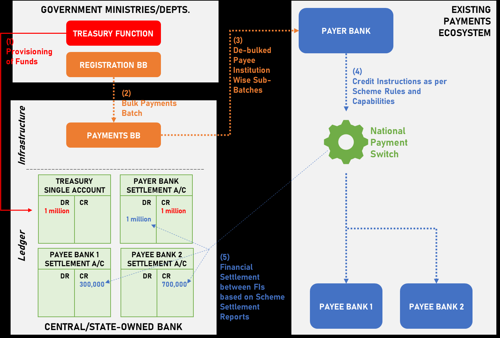
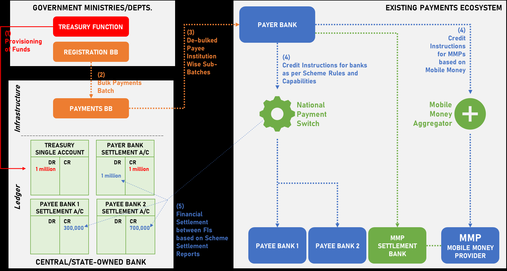

= Main

https://admin-dashboard-mifos-bb.playground.sandbox-playground.com/[Live demo].

helm delete my-ph-ee-g2psandbox

helm upgrade --install  my-ph-ee-g2psandbox ./g2p-sandbox/  --create-namespace --namespace paymenthub

== logs

kubectl logs ph-ee-identity-account-mapper-6c85bd567b-n698n -n paymenthub > log.log

kubectl logs ph-ee-vouchers-5f4fdd5c8b-9krlc -n paymenthub > vouchers.log

kubectl get event --namespace paymenthub --field-selector involvedObject.name=ph-ee-vouchers-5f4fdd5c8b-9krlc

== events

----
LAST SEEN   TYPE      REASON      OBJECT                                MESSAGE
33m         Normal    Scheduled   pod/ph-ee-vouchers-5f4fdd5c8b-9krlc   Successfully assigned paymenthub/ph-ee-vouchers-5f4fdd5c8b-9krlc to ip-10-42-9-42.eu-central-1.compute.internal
31m         Normal    Pulling     pod/ph-ee-vouchers-5f4fdd5c8b-9krlc   Pulling image "docker.io/openmf/ph-ee-vouchers:v1.3.1"
33m         Normal    Pulled      pod/ph-ee-vouchers-5f4fdd5c8b-9krlc   Successfully pulled image "docker.io/openmf/ph-ee-vouchers:v1.3.1" in 10.672098933s (10.672109113s including waiting)
31m         Normal    Created     pod/ph-ee-vouchers-5f4fdd5c8b-9krlc   Created container ph-ee-vouchers
31m         Normal    Started     pod/ph-ee-vouchers-5f4fdd5c8b-9krlc   Started container ph-ee-vouchers
30m         Warning   Unhealthy   pod/ph-ee-vouchers-5f4fdd5c8b-9krlc   Liveness probe failed: Get "http://10.42.9.35:8080/actuator/health/liveness": dial tcp 10.42.9.35:8080: connect: connection refused
23m         Warning   Unhealthy   pod/ph-ee-vouchers-5f4fdd5c8b-9krlc   Readiness probe failed: Get "http://10.42.9.35:8080/actuator/health/readiness": dial tcp 10.42.9.35:8080: connect: connection refused
31m         Warning   Unhealthy   pod/ph-ee-vouchers-5f4fdd5c8b-9krlc   Readiness probe failed: Get "http://10.42.9.35:8080/actuator/health/readiness": context deadline exceeded (Client.Timeout exceeded while awaiting headers)
31m         Warning   Unhealthy   pod/ph-ee-vouchers-5f4fdd5c8b-9krlc   Liveness probe failed: Get "http://10.42.9.35:8080/actuator/health/liveness": context deadline exceeded (Client.Timeout exceeded while awaiting headers)
30m         Normal    Killing     pod/ph-ee-vouchers-5f4fdd5c8b-9krlc   Container ph-ee-vouchers failed liveness probe, will be restarted
31m         Normal    Pulled      pod/ph-ee-vouchers-5f4fdd5c8b-9krlc   Successfully pulled image "docker.io/openmf/ph-ee-vouchers:v1.3.1" in 766.664857ms (766.675327ms including waiting)
3m46s       Warning   BackOff     pod/ph-ee-vouchers-5f4fdd5c8b-9krlc   Back-off restarting failed container
18m         Normal    Pulled      pod/ph-ee-vouchers-5f4fdd5c8b-9krlc   Successfully pulled image "docker.io/openmf/ph-ee-vouchers:v1.3.1" in 738.090282ms (738.102802ms including waiting)

----

== Voucher pod restart

Fix = initialDelaySeconds: 90

== USCT connection

== registering institution ID
https://mifos.gitbook.io/docs/payment-hub-ee/overview/installation-instructions/configuration-instructions/how-to-setup-the-registering-institution-id-with-budget-account

=== Register Beneficiary

I have tried to simplify this so I may have cut more features you want out of it.

Ultimately though as you are not connecting to a real payment provider behind all this you can simplify you life a bit and just use one modality for example.

So register beneficiary should be to the following endpoint:
`/identityAccountMapper/beneficiary`

Method should be POST
Header must have the following:

Then the request body should be the following obviously remove my comments to help you from it
 Headers
----
X-Callback-URL: this is the string of the URL on which you want the result published
X-Registering-Institution-ID: this is unique ID to identify the source Ministry/Org that has registered the beneficiary, program ID effectively

----

[,json]
----
{
"RequestID": "123456789102", <.>
"Beneficiaries": [
  {
   "payeeIdentity ": "94049169714828912115", <.>
   "PaymentModality": "00",     <.>
   "Financial Address": "LB28369763644714781256435714"
  }
]
----
<.> This needs to be a unique ID every time you sent a request 12 char string
<.> This is the functionalID from the registration BB
<.> for Bank Account. 01 for Mobile Money 02 for voucher 03 for Digital Wallet 04 for proxy

For validation step can you clarify what you are wanting to validate? e.g. that the beneficiary exists in the Payments Identity Account Mapper? Otherwise if you are checking end accounts actually exist that is just part of the bulk payment flow so you only need one call in the USCT usecase at that step.

=== Bulk payment

Endpoint:   `/batchtransactions?type=raw`
Method:  POST
Header Fields you must have:
X-CorrelationID // string 20 chars of a unique request/correlation ID to tie back to any logs in the RegBB

Platform-TennantID // string 20 chars this is probably Gorilla or Rhino etc if you have used our standard charts

X-Callback-URL // string 100 chars of the URL you want the response at

There are optional Header fields such as program ID but I have excluded these for simplicity as I assume you are keeping just one in this demo.
The request body should then be as follows:

[,json]
----
[
    {
        "requestId":"8238482323" <.>
        "creditParty": [      <.>
            {
                "key": "msisdn",
                "value": "8837461856"
            }
        ],
        "debitParty": [        <.>
            {
                "key": "accountnumber",
                "value": "003001003874120160", <.>
            }
        ],
        "paymentMode": "closedLoop",
        "amount": "820.00",
        "currency": "SGD",
        "descriptionText": "Test Payment"
    },
    {.....}     <.>
 ]
----
<.> This needs to be unique for each request in the payload and globally
<.> Payer
<.> Payee/Beneficiary
<.> functionalID of the beneficiary
<.> JSON array so you can send multiple requests

=== part of the official docs

4.1.1 Scenario 2
The scenario described is one where a payment switch connecting financial service providers such as banks to non-banks including mobile money providers is in place and actively working.

Figure 03 – Scenario 2 Overview

In such a scenario the Payment BB operates from within Central Bank Infrastructure, whether the TSA lies in the Central Bank or with a commercial bank is immaterial to the Payments Building Block.
Payments Building Block does not interface directly with the Payment Switch, Payments Building Block interfaces with the Switch/Scheme through a Participant of the Switch/Scheme. The Payer forwards all instructions to the Scheme/Switch.
4.1.2 Scenario 3
A payment switch is in place in the country or is in the process of being deployed but non-banks, including mobile providers, are not connected to it.

Figure 04 – Scenario 3 Overview

Payment BB operates from within Central Bank Infrastructure, whether the TSA lies in the Central Bank or with a commercial bank is immaterial to the Payments Building Block.

The Payments Building Block does not interface directly with the Payment Switch or the Mobile Money aggregator, Payments Building Block interfaces with the Switch/Scheme through a Participant of the Switch/Scheme. The Payer forwards all instructions to the Scheme/Switch.
